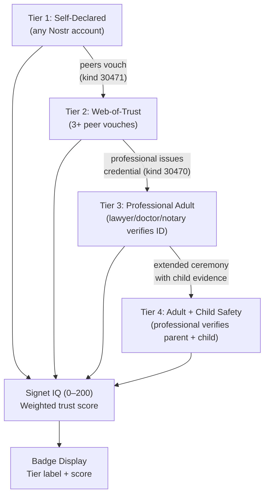
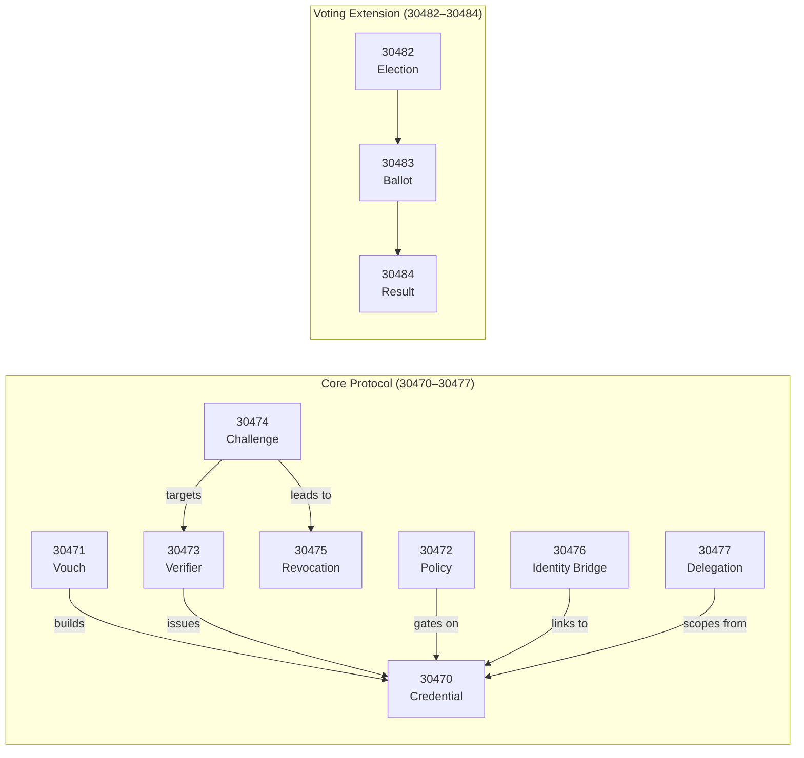
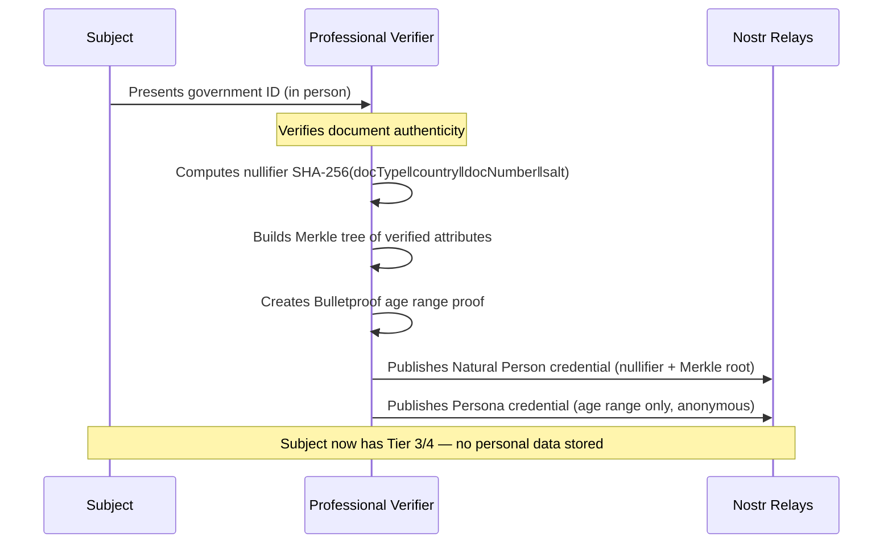
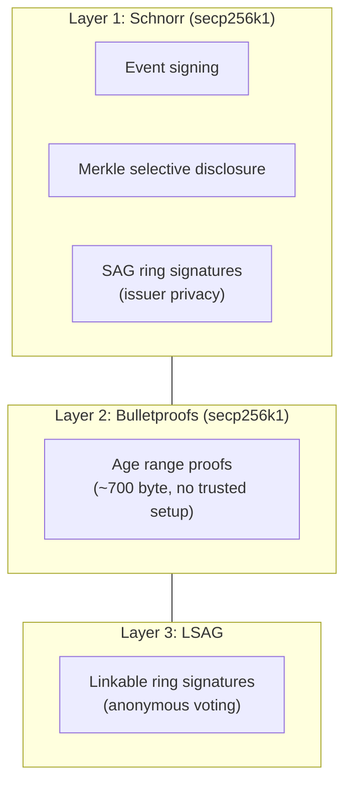
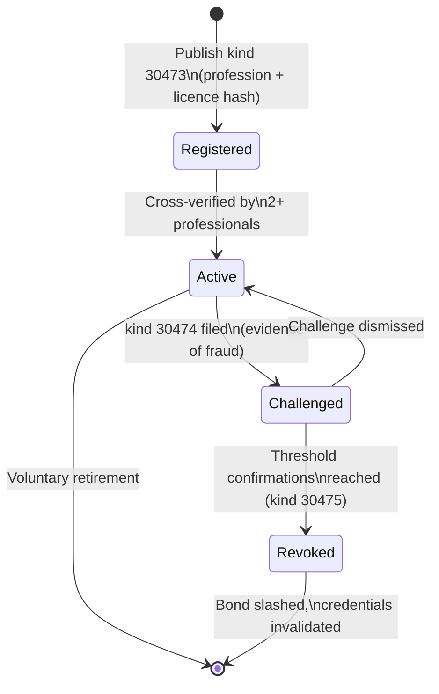

# Signet Documentation

Signet is a decentralised identity verification protocol for Nostr. It lets users prove claims about their identity using zero-knowledge proofs, without revealing personal data or relying on a central authority.

## Architecture

### Trust Flow

### Event Kinds

### Verification Ceremony (Tier 3/4)

### Crypto Stack

### Verifier Lifecycle

## Guides

| Document | Description |
|----------|-------------|
| [Signet in 5 Minutes](signet-in-5-minutes.md) | One-page developer overview with code examples |
| [Implementation Levels](implementation-levels.md) | Three-level integration guide (weekend → weeks) |
| [Local Development](spinup.md) | Relay setup, app spinup, certificates |
| [Origin Story](origin-story.md) | How and why Signet was created |

## Specifications

| Document | Description |
|----------|-------------|
| [Protocol Specification](../spec/protocol.md) | Full protocol spec — 25 sections, source of truth |
| [Voting Extension](../spec/voting.md) | Anonymous voting via linkable ring signatures |

## Examples

| Example | Description |
|---------|-------------|
| [Full Flow](../examples/full-flow.ts) | All 4 tiers, trust scoring, policies, verifier lifecycle, Merkle disclosure |
| [Signet Me](../examples/signet-me.ts) | Time-based word verification for peer identity proofs |
| [UK Solicitor](../examples/jurisdictions/uk-solicitor.ts) | Jurisdiction-specific: UK solicitor verification |
| [US Attorney](../examples/jurisdictions/us-attorney.ts) | Jurisdiction-specific: US attorney verification |
| [EU Doctor](../examples/jurisdictions/eu-doctor.ts) | Jurisdiction-specific: EU doctor verification |
| [Brazil Lawyer](../examples/jurisdictions/brazil-lawyer.ts) | Jurisdiction-specific: Brazil lawyer verification |
| [India Doctor](../examples/jurisdictions/india-doctor.ts) | Jurisdiction-specific: India doctor verification |
| [Japan Notary](../examples/jurisdictions/japan-notary.ts) | Jurisdiction-specific: Japan notary verification |
| [UAE Professional](../examples/jurisdictions/uae-professional.ts) | Jurisdiction-specific: UAE professional verification |
| [Multi-Jurisdiction](../examples/jurisdictions/multi-jurisdiction.ts) | Cross-border compliance across multiple jurisdictions |

## Reports

| Document | Description |
|----------|-------------|
| [Security & Production Readiness Review](reports/2026-03-12-security-production-readiness-review.md) | Comprehensive security review findings |
| [Professional Identity Fraud Deep Dive](reports/2026-03-04-professional-identity-fraud-deep-dive.md) | Analysis of professional identity fraud vectors |

## For LLMs

| File | Description |
|------|-------------|
| [llms.txt](../llms.txt) | Concise LLM-optimised overview (~100 lines) |
| [llms-full.txt](../llms-full.txt) | Full context: llms.txt + protocol spec + voting spec + developer guides |
